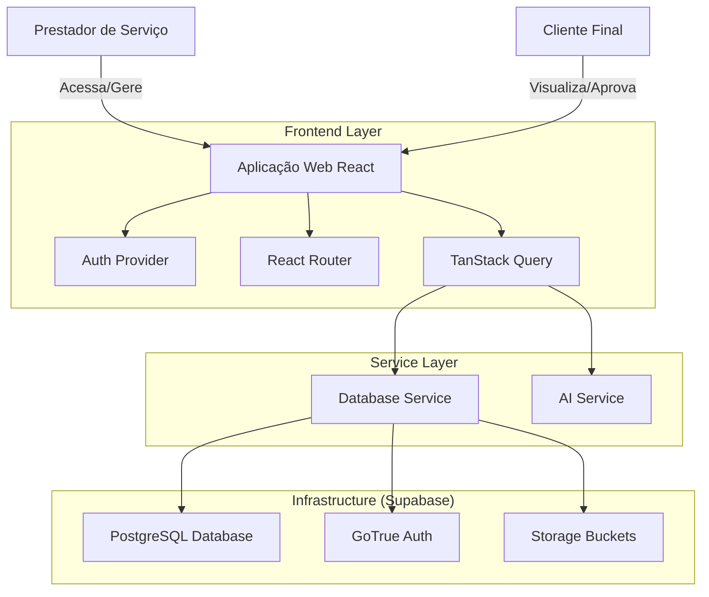

# Arquitetura do Sistema - Gerador de Orçamento e Contrato

> **Nota:** Este documento serve como referência técnica definitiva para o sistema "Gerador de Orçamento e Contrato". Ele descreve a arquitetura, decisões de design e detalhes de implementação para desenvolvedores e arquitetos.

## 1. Sumário Executivo

O **Gerador de Orçamento e Contrato** é uma aplicação web progressiva (PWA) projetada para prestadores de serviços e pequenas empresas. O sistema permite a criação, gestão e compartilhamento de orçamentos e contratos profissionais, com foco na facilidade de uso em dispositivos móveis e desktop.

A aplicação opera no modelo SaaS (Software as a Service), oferecendo funcionalidades como:
- Gestão de Clientes (CRM leve)
- Criação de Orçamentos com cálculo automático
- Geração de Contratos baseados em templates
- Assinatura digital (técnica e do cliente)
- Visualização pública para clientes finais via link seguro
- Integração com WhatsApp para envio rápido

## 2. Visão Geral da Arquitetura

O sistema segue uma arquitetura **Single Page Application (SPA)** moderna, utilizando renderização no lado do cliente (CSR) com uma infraestrutura de Backend-as-a-Service (BaaS).

### Stack Tecnológico

| Camada | Tecnologia | Propósito |
|--------|------------|-----------|
| **Frontend** | React 19 + TypeScript | Biblioteca de UI e tipagem estática |
| **Build Tool** | Vite | Bundling rápido e desenvolvimento local |
| **Estilização** | Tailwind CSS | Utility-first CSS framework |
| **State Management** | TanStack Query (React Query) | Gerenciamento de estado assíncrono e cache |
| **Routing** | React Router v6 (v7 compat) | Navegação client-side |
| **Backend/DB** | Supabase | Auth, PostgreSQL, Storage, Edge Functions |
| **Integração** | WhatsApp API (Deep Links) | Comunicação com clientes |

### Diagrama de Contexto (Conceitual)

## 3. Decisões de Design

### 3.1. Separação de Responsabilidades
O código é organizado para separar a lógica de negócios da interface do usuário:
- **`pages/`**: Componentes de visualização que compõem as rotas.
- **`components/`**: Componentes de UI reutilizáveis e "dumb components".
- **`services/`**: Lógica de interação direta com APIs e Banco de Dados (`database.ts`, `ai.ts`).
- **`hooks/`**: Abstração de busca de dados (Custom Hooks wrapping React Query).
- **`types.ts`**: Definições de tipos TypeScript compartilhados.

### 3.2. Estratégia de Fetching (TanStack Query)
Adotamos o TanStack Query para substituir o gerenciamento de estado global complexo (como Redux) para dados do servidor.
- **Cache**: `staleTime` de 5 minutos para reduzir requisições.
- **Mutações**: Invalidação automática de queries (`invalidateQueries`) após updates/creates para garantir consistência de UI.
- **Otimização**: As chamadas de banco são granulares e tipadas.

### 3.3. Document Layout System
Para garantir que orçamentos e contratos pareçam documentos profissionais (A4):
- Utilizamos um componente `DocumentLayout` que simula as dimensões físicas de papel na tela.
- Classes utilitárias `no-print` do Tailwind são usadas para ocultar elementos de UI (botões, navegação) durante a impressão/geração de PDF pelo browser.

## 4. Componentes Principais

### 4.1. Módulo de Orçamentos (`Quotes`)
O núcleo do sistema.
- **Entidade**: `Quote` (tabela `quotes`).
- **Fluxo**:
  1. Criação (`NewQuoteForm`): Seleção de cliente, serviços e materiais.
  2. Cálculo: `total_value` calculado no frontend e persistido.
  3. Status: `DRAFT` -> `SENT` -> `APPROVED` -> `COMPLETED`.
  4. Visualização Pública: Rota `/v/:token` permite acesso sem login (usando RLS policies públicas ou funções específicas).

### 4.2. Módulo de Contratos (`Contracts`)
- **Entidade**: `ContractTemplate` e tabela `contracts` (vinculada a `quotes`).
- **Estratégia de Armazenamento**: O conteúdo do contrato (texto longo/HTML) é armazenado em uma tabela separada (`contracts`) para manter a tabela `quotes` leve e performática.
- **Geração**: O conteúdo é gerado mesclando dados do orçamento em templates pré-definidos.

### 4.3. Autenticação e Segurança
- **Provedor**: Supabase Auth.
- **Proteção de Rotas**: Componente `PrivateRoute` verifica sessão e status da assinatura (`subscription_status`).
- **RLS (Row Level Security)**: Todas as tabelas sensíveis (`quotes`, `clients`) devem ter políticas RLS garantindo que usuários só acessem seus próprios dados (`auth.uid() = user_id`).

## 5. Modelagem de Dados

O esquema do banco de dados (simplificado) reflete as entidades de negócio:

- **`profiles`**: Dados da empresa do usuário (extensão da tabela `auth.users`).
- **`clients`**: Carteira de clientes do usuário.
- **`quotes`**: Cabeçalho dos orçamentos (valores, datas, status).
  - *Relacionamento*: `user_id` (FK -> auth.users), `client_id` (FK -> clients).
  - *Campos JSON*: `services`, `materials` são armazenados como JSONB para flexibilidade.
- **`contracts`**: Conteúdo detalhado dos contratos.
  - *Relacionamento*: `quote_id` (FK -> quotes).

## 6. Integração e Extensibilidade

### 6.1. WhatsApp
A integração é feita via "Deep Links" (`wa.me`). Não há automação de backend para envio, o que simplifica a arquitetura e reduz custos/complexidade de conformidade com a Meta. O frontend constrói a mensagem pré-formatada com o link público do orçamento.

### 6.2. AI Services
O arquivo `services/ai.ts` sugere integração com Google Generative AI (Gemini) para funcionalidades assistivas, possivelmente para gerar descrições de serviços ou cláusulas contratuais.

## 7. Guia de Desenvolvimento

### Padrões de Código
- **Componentes**: Function Components com Hooks.
- **Estilos**: Tailwind CSS para tudo. Evitar CSS puro ou CSS Modules.
- **Tipagem**: Uso estrito de interfaces exportadas em `types.ts`.

### Adicionando uma Nova Feature
1. **Database**: Criar migração SQL em `supabase/migrations/`.
2. **Types**: Atualizar `types.ts` com novas interfaces.
3. **Service**: Adicionar métodos em `services/database.ts`.
4. **Hook**: Criar hook em `hooks/useQueries.ts`.
5. **UI**: Criar página/componente e adicionar rota em `App.tsx`.

## 8. Considerações de Infraestrutura

- **Deploy**: O frontend é estático e pode ser hospedado em qualquer CDN (Vercel, Netlify).
- **Database**: Gerenciado pelo Supabase.
- **Migrações**: Devem ser aplicadas via Supabase CLI ou SQL Editor para manter consistência entre ambientes dev/prod.
